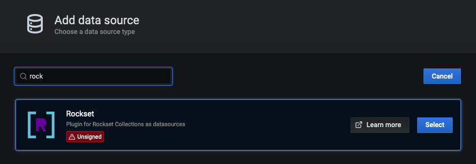
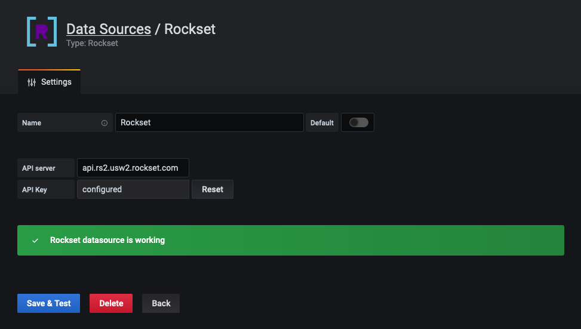
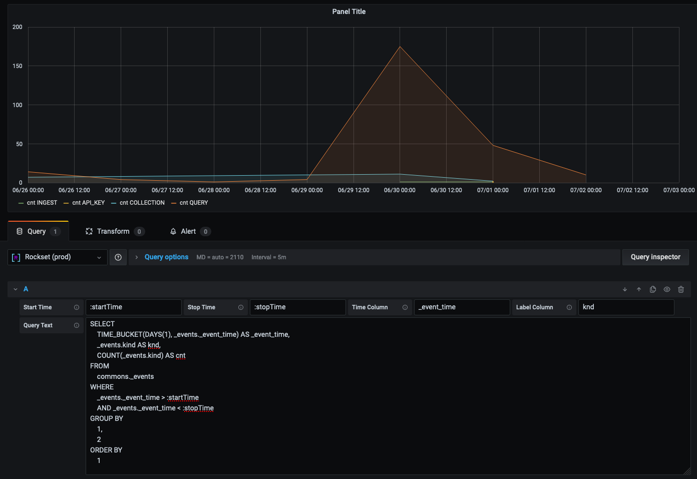

# Grafana Rockset Data Source Backend Plugin

[](https://circleci.com/gh/rockset/rockset-grafana-backend/tree/master)

The Rockset plugin lets you write queries against your Rockset collections and visualize the
results as time series in Grafana.

Detailed setup instructions can be found in the [Rockset documentation](https://docs.rockset.com/grafana/).

The query has two required query parameters, named `:startTime` and `:endTime` by default, which must be used
in a `WHERE` clause to scope the query to the selected time period in Grafana (or you will end up querying
your entire collection).

A sample query to graph Rockset events by 5 minute intervals

```
SELECT
    TIME_BUCKET(MINUTES(5), _events._event_time) AS _event_time,
    COUNT(_events.type) AS value
FROM
    commons._events
WHERE
    _events._event_time > :startTime AND
    _events._event_time < :stopTime
GROUP BY
    _event_time
ORDER BY
    _event_time
```

You can use one column of the result to label the data, e.g. in the below query the `type` is the label column

```
SELECT
    TIME_BUCKET(MINUTES(5), _events._event_time) AS _event_time,
    _events.type,
    COUNT(_events.type) AS value
FROM
    commons._events
WHERE
    _events._event_time > :startTime AND
    _events._event_time < :stopTime
GROUP BY
    _event_time,
    type
ORDER BY
    _event_time
```

# Installation

Install the plugin using the `grafana-cli`. Note that the plugin require Grafana 7.x!

```
grafana-cli \
  --pluginUrl https://rockset-public.s3-us-west-2.amazonaws.com/rockset-backend-datasource-0.1.2.zip \
  plugins install rockset-backend-datasource
```

Since this is a backend plugin, it requires the plugin to be signed,
which the 
[Grafana team hasn't implemented yet](https://grafana.com/docs/grafana/latest/developers/plugins/sign-a-plugin/), 
so you have to set the environment variable
`GF_PLUGINS_ALLOW_LOADING_UNSIGNED_PLUGINS` to `rockset-backend-datasource` for the plugin to be loaded.

Now you can add a new datasource



You get the API key from the [Rockset console](https://console.rockset.com/apikeys) and then enter it in the plugin configuration.



Now you are ready to add a new panel and can select the new datasource you added



## Test-driving the plugin

If you want to test the plugin before you install it on your production Grafana server, you can use docker

```
docker run -d \
    -p 3000:3000 \
    -e "GF_PLUGINS_ALLOW_LOADING_UNSIGNED_PLUGINS=rockset-backend-datasource" \
    --name=grafana \
    grafana/grafana:7.0.5
docker exec grafana-cli \
    --pluginUrl https://rockset-public.s3-us-west-2.amazonaws.com/rockset-backend-datasource-0.1.2.zip \
    plugins install rockset-backend-datasource
docker restart grafana
```

After this you should see a line in the logs like this

```
t=2020-07-09T15:42:28+0000 lvl=warn msg="Running an unsigned backend plugin" logger=plugins pluginID=rockset-backend-datasource pluginDir=/var/lib/grafana/plugins/rockset-backend-datasource
```

which shows that the plugin loaded correctly.

# Plugin Development

The Rockset data source backend plugin consists of both frontend and backend components.

## Frontend

1. Install dependencies    
    ```BASH
    yarn install
    ```
2. Build plugin in development mode or run in watch mode  
    ```BASH
    yarn dev
    ```
    or
    ```BASH
    yarn watch
    ```
3. Build plugin in production mode
    ```BASH
    yarn build
    ```

## Backend

You need to setup `mage` which is used to build the backend plugin.

```BASH
git clone https://github.com/magefile/mage
cd mage
go run bootstrap.go
```

1. Build backend plugin binaries for Linux, Windows and Darwin:
    ```BASH
    mage -v
    ```

2. List all available Mage targets for additional commands:
    ```BASH
    mage -l
    ```

## Testing

Run grafana in a docker container

```
docker run -d \
    -p 3000:3000 \
    -v "$(pwd)/..:/var/lib/grafana/plugins" \
    -e "GF_PLUGINS_ALLOW_LOADING_UNSIGNED_PLUGINS=rockset-backend-datasource" \
    --name=grafana \
    grafana/grafana:7.0.5
```

Since Grafana only loads plugins on start-up, you need to restart the container whenever you add or remove a plugin.

```
docker restart grafana
```
