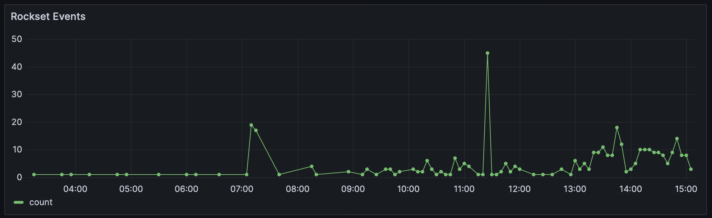
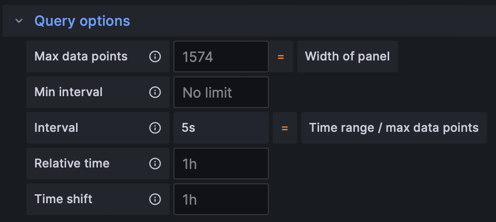
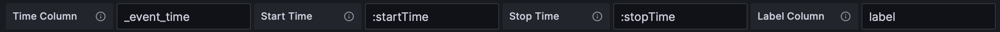
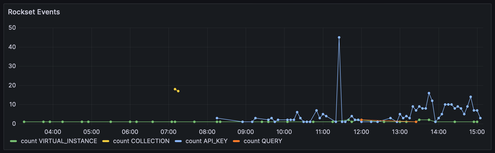
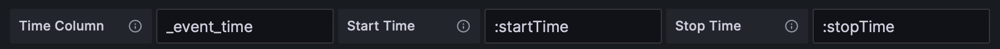
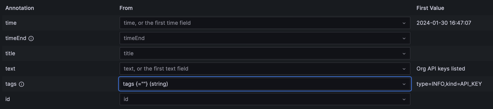
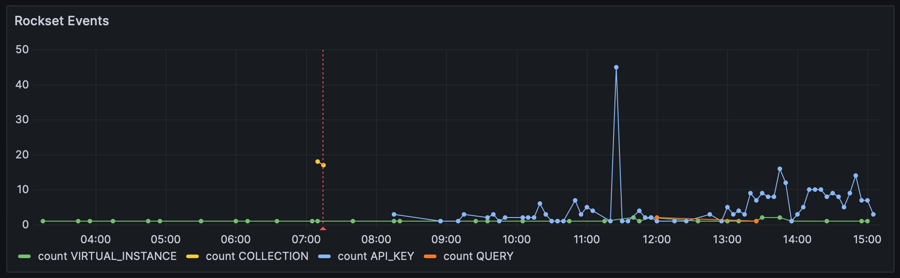
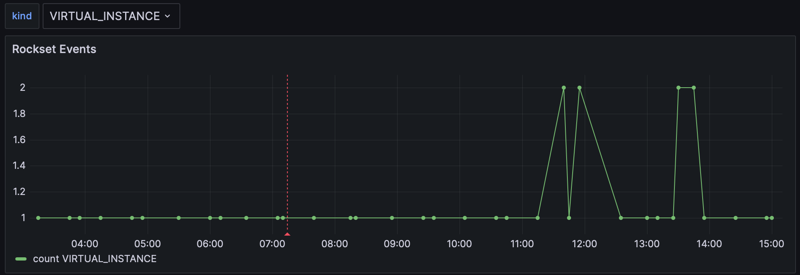
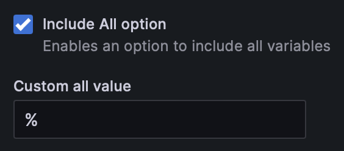

# Grafana Rockset Data Source Backend Plugin

The Rockset plugin lets you write queries against your Rockset collections and visualize the results as time series in Grafana.

Detailed setup instructions can be found in the [Rockset documentation](https://docs.rockset.com/documentation/docs/grafana).

## Installation

For a detailed guide on how to install and configure the plugin,
see the [Grafana plugin installation documentation](https://grafana.com/docs/grafana/latest/administration/plugin-management/).

The quckstart is to use the `grafana cli` to install the plugin from the Rockset public S3 bucket:
```
grafana cli \
  --pluginUrl https://github.com/rockset/rockset-grafana-backend/releases/download/v0.3.0/rockset-backend-datasource-0.3.0.zip \
  plugins install rockset-backend-datasource
```

⚠️ This requires setting the `GF_PLUGINS_ALLOW_LOADING_UNSIGNED_PLUGINS` environment variable to `rockset-backend-datasource`.

## Query Types

The plugin supports three types of queries:

1. Metrics
2. [Annotations](https://grafana.com/docs/grafana/latest/dashboards/build-dashboards/annotate-visualizations/)
3. [Variables](https://grafana.com/docs/grafana/latest/dashboards/variables/)

The examples below use the `_events` collection from the `commons` workspace, as it exists in every Rockset organization.

## Metric Queries

The query has two required query parameters, named :startTime and :endTime by default, 
which must be used in a `WHERE` clause to scope the query to the selected time period in Grafana (or you will end up querying your entire collection).

A sample query to graph Rockset events grouped by 5 minute intervals

```SQL
SELECT
    TIME_BUCKET(MINUTES(5), _events._event_time) AS _event_time,
    COUNT(_events.type) AS count
FROM
    commons._events
WHERE
    _events._event_time > :startTime AND
    _events._event_time < :stopTime
GROUP BY
    _event_time
ORDER BY
    _event_time DESC
```



Instead of a fixed interval, it is possible to use `:interval` which is SQL query parameter that the plugin injects into the request,
and is based on the Grafana variable `$__interval`, which is set to the time range divided by the max number of datapoints.



The `:interval` is in milliseconds, so the bucket should use `MILLISECONDS()`, e.g.
```SQL
SELECT 
    TIME_BUCKET(MILLISECONDS(:interval), _events._event_time) AS _event_time,
```

### Labeling Data

You can use one column of the result to label the data, e.g. in the below query the type is the label column

```SQL
SELECT
    TIME_BUCKET(MINUTES(5), _events._event_time) AS _event_time,
    COUNT(_events.type) AS count,
    e.kind AS label
FROM
    commons._events
WHERE
    _events._event_time > :startTime AND
    _events._event_time < :stopTime 
GROUP BY
    _event_time,
    label
ORDER BY
    _event_time DESC
```
note that the label column must exist in the SQL query, in this case `label`





## Annotation Queries

You can also use Rockset to store annotations and display them in Grafana.

```SQL
SELECT
    e._event_time as _event_time,
    CASE
        WHEN e.message IS NOT NULL THEN e.message
        ELSE 'no text found'
    END AS text,
    FORMAT('type={},kind={}', e.type, e.kind) AS tags
FROM
    commons._events e
WHERE
  e._event_time > :startTime AND
  e._event_time < :stopTime AND
  e.type = 'ERROR'
ORDER BY
    time DESC
```



Grafana only auto-detects the time and text fields, so you need to manually select any other field.


Once the annotations are configured, they will appear on the graph.



## Variable Queries

You can extract variables using SQL queries

```SQL
select
  e.kind
from
  commons._events e
group by
  kind
ORDER BY
  kind
```

and then use them to interpolate variables into queries

```SQL
SELECT
    TIME_BUCKET(MINUTES(5), _events._event_time) AS _event_time,
    COUNT(_events.type) AS count,
    e.kind AS label
FROM
    commons._events
WHERE
    _events._event_time > :startTime AND
    _events._event_time < :stopTime AND
    e.kind LIKE '$kind'
GROUP BY
    _event_time,
    label
ORDER BY
    _event_time DESC
```



You can include an `ALL` option using the SQL wildcard character `%`



# Plugin Development

## Backend

1. Update [Grafana plugin SDK for Go](https://grafana.com/developers/plugin-tools/introduction/grafana-plugin-sdk-for-go) dependency to the latest minor version:

   ```bash
   go get -u github.com/grafana/grafana-plugin-sdk-go
   go mod tidy
   ```

2. Build backend plugin binaries for Linux, Windows and Darwin:

   ```bash
   mage -v
   ```

3. List all available Mage targets for additional commands:

   ```bash
   mage -l
   ```

## Frontend

1. Install dependencies

   ```bash
   npm install
   ```

2. Build plugin in development mode and run in watch mode

   ```bash
   npm run dev
   ```

3. Build plugin in production mode

   ```bash
   npm run build
   ```

4. Run the tests (using Jest)

   ```bash
   # Runs the tests and watches for changes, requires git init first
   npm run test

   # Exits after running all the tests
   npm run test:ci
   ```

5. Spin up a Grafana instance and run the plugin inside it (using Docker)

   ```bash
   npm run server
   ```

6. Run the E2E tests (using Cypress)

   ```bash
   # Spins up a Grafana instance first that we tests against
   npm run server

   # Starts the tests
   npm run e2e
   ```

7. Run the linter

   ```bash
   npm run lint

   # or

   npm run lint:fix
   ```
## Test-driving the plugin

```bash
docker run -d \
    -p 3000:3000 \
    -e "GF_PLUGINS_ALLOW_LOADING_UNSIGNED_PLUGINS=rockset-backend-datasource" \
    --name=grafana \
    grafana/grafana:10.0.3
docker exec grafana \
    grafana cli \
    --pluginUrl https://github.com/rockset/rockset-grafana-backend/releases/download/v0.3.0/rockset-backend-datasource-0.3.0.zip \
    plugins install rockset-backend-datasource
docker restart grafana
```
